 

---

# 🚀 DevSecOps Security Automation Platform

## For FuzzyNeuroOptimizer

<p align="center">


</p>

---

# 📌 Project Overview

The **DevSecOps Security Automation Platform** integrates security into every stage of the Software Development Lifecycle (SDLC).

It automates:

```text
✔ Source Code Management
✔ Continuous Integration
✔ Security Testing
✔ Vulnerability Scanning
✔ Containerization
✔ Kubernetes Deployment
✔ Infrastructure Automation
✔ Monitoring & Logging
✔ Continuous Security Validation
```

---

# 🎯 Project Goals

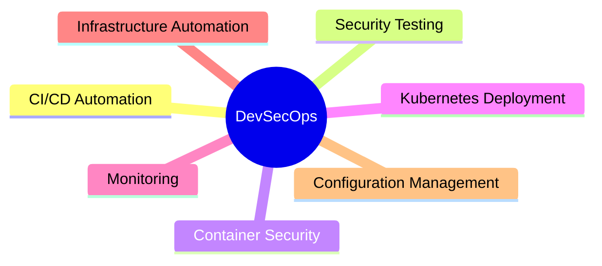

---

# 🏗 High Level Architecture

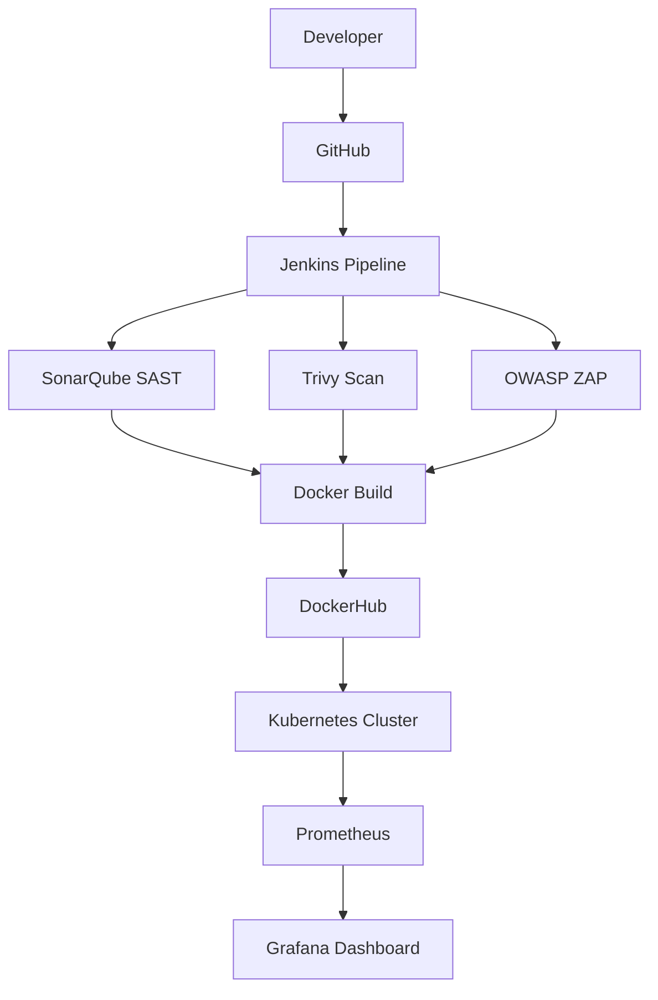

---

# 🔄 Complete DevSecOps Workflow

```mermaid
flowchart LR

Code[Developer Code]

GitHub[GitHub Repository]

Jenkins[Jenkins Pipeline]

Sonar[SonarQube]

Trivy[Trivy]

Docker[Docker Build]

DockerHub[Docker Registry]

K8s[Kubernetes]

Zap[OWASP ZAP]

Grafana[Monitoring]

Code --> GitHub

GitHub --> Jenkins

Jenkins --> Sonar

Sonar --> Trivy

Trivy --> Docker

Docker --> DockerHub

DockerHub --> K8s

K8s --> Zap

Zap --> Grafana
```

---

# 🛠 Technology Stack

| Category                 | Technology |
| ------------------------ | ---------- |
| Frontend                 | React      |
| Backend                  | Node.js    |
| Database                 | PostgreSQL |
| CI/CD                    | Jenkins    |
| Code Quality             | SonarQube  |
| Vulnerability Scanning   | Trivy      |
| Containerization         | Docker     |
| Orchestration            | Kubernetes |
| DAST                     | OWASP ZAP  |
| Infrastructure           | Terraform  |
| Configuration Management | Ansible    |
| Monitoring               | Prometheus |
| Visualization            | Grafana    |

---

# 📂 Project Structure

```text
FuzzyNeuroOptimizer
│
├── client/
├── server/
├── shared/
│
├── Dockerfile
├── Jenkinsfile
├── sonar-project.properties
│
├── terraform/
│   ├── main.tf
│   └── variables.tf
│
├── ansible/
│   ├── inventory
│   └── playbook.yml
│
├── k8s/
│   ├── deployment.yaml
│   ├── service.yaml
│   └── hpa.yaml
│
└── reports/
```

---

# 🔐 Security Layers

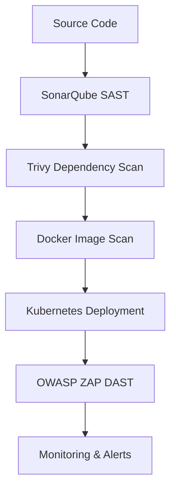

---

# 🐳 Docker Lifecycle

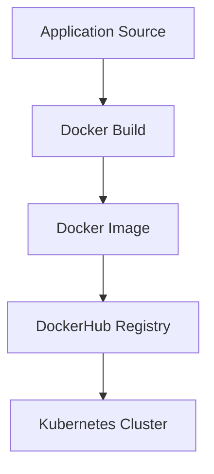

---

# ☸ Kubernetes Architecture

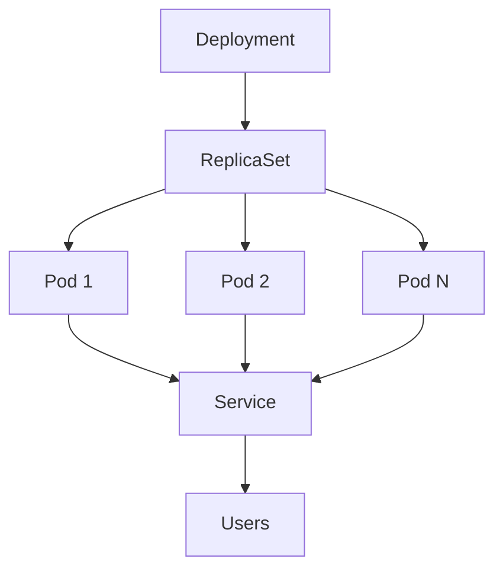

---

# 🌍 Infrastructure Automation

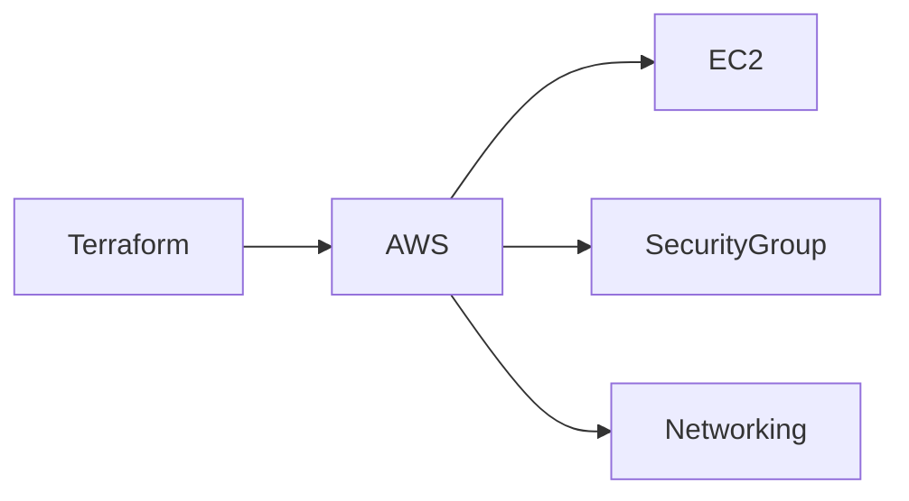

### Provisioned Resources

* EC2 Instance
* Security Groups
* Networking
* Kubernetes Infrastructure

---

# ⚙ Configuration Management

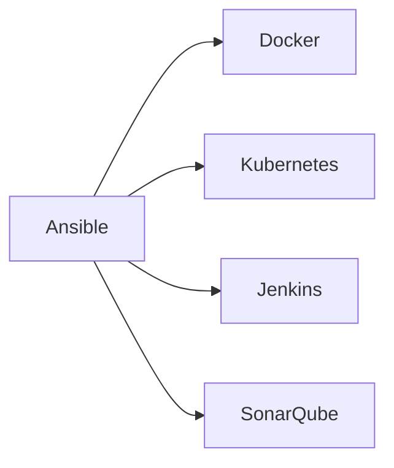

---

# 📊 Monitoring Stack

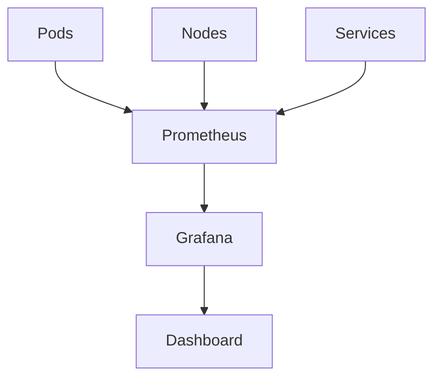

---

# 📈 Jenkins Pipeline Visualization

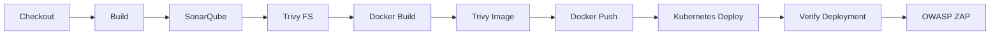

---

# 📋 Pipeline Stages

| Stage             | Description             |
| ----------------- | ----------------------- |
| Checkout          | Pull Source Code        |
| Build             | Compile Application     |
| SonarQube         | Static Analysis         |
| Trivy FS          | Dependency Scan         |
| Docker Build      | Create Image            |
| Trivy Image       | Container Security Scan |
| Docker Push       | Publish Image           |
| Kubernetes Deploy | Deploy Application      |
| Verify Deployment | Health Check            |
| OWASP ZAP         | Dynamic Security Test   |

---

# 📊 Project Success Dashboard

| Metric                    | Status |
| ------------------------- | ------ |
| CI/CD Automation          | ✅      |
| SAST Integration          | ✅      |
| DAST Integration          | ✅      |
| Docker Automation         | ✅      |
| Kubernetes Deployment     | ✅      |
| Infrastructure Automation | ✅      |
| Monitoring                | ✅      |
| Security Scanning         | ✅      |

### Success Rate

```text
Automation          ████████████████████ 100%
Security Testing    ████████████████████ 100%
Containerization    ████████████████████ 100%
Kubernetes          ████████████████████ 100%
Monitoring          ████████████████████ 100%
```

---

# 🎓 Learning Outcomes

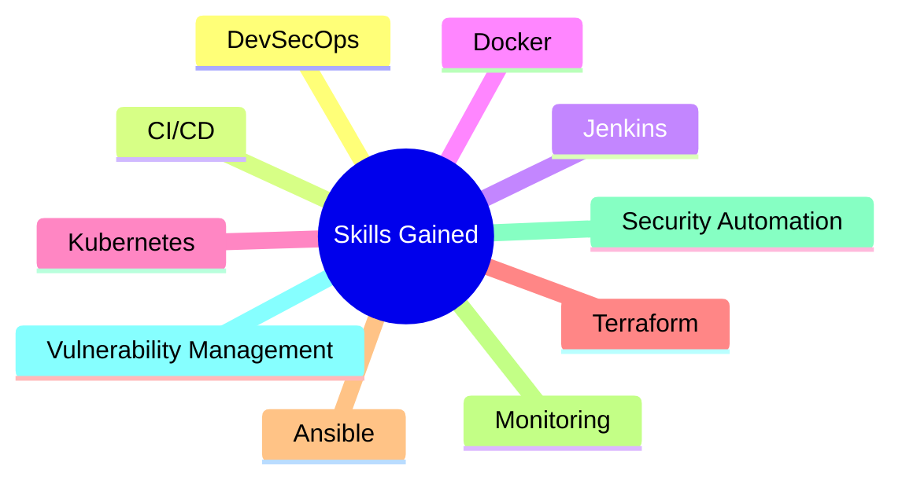

---

# 👨‍💻 Author

### Parth Kale

🎓 B.Tech Computer Science & Engineering (Data Science)

🏫 VIIT Pune

🚀 DevSecOps | Cloud | Kubernetes | Security Automation | AI/ML

---

 
